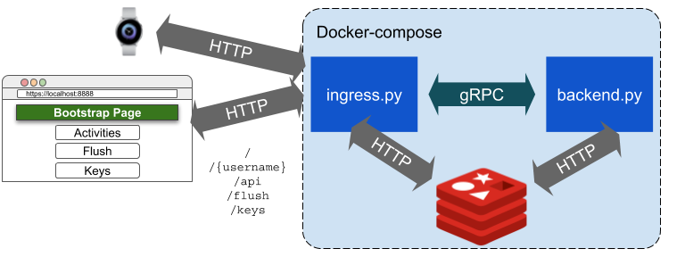

## Drunkare MLaaS

### Prerequisites
* Docker (See [here](https://docs.docker.com/install/linux/docker-ce/ubuntu/))
* docker-compose (Run `pip install docker-compose`)

### Run
```
# Clean startup
$ docker-compose up

# After updates
$ docker-compose up --force-recreate --build
```

### Overview


